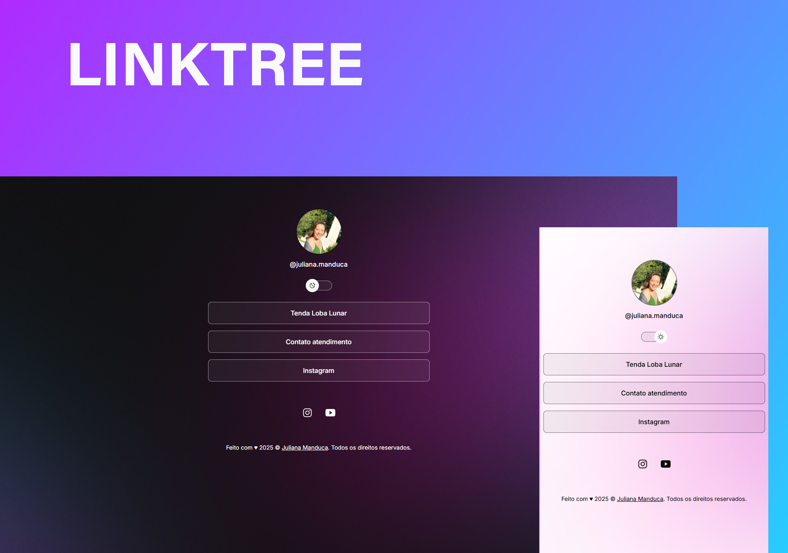

<h1 align="center"> 🌐 Juliana Manduca personal linktree </h1>

Case de estudos desenvolvido a partir do programa, promovido pela Rocketseat para ensino de tecnologias WEB.  

  <a href="#-tecnologias">Tecnologias</a>&nbsp;&nbsp;&nbsp;|&nbsp;&nbsp;&nbsp;
  <a href="#-projeto">Projeto</a>&nbsp;&nbsp;&nbsp;|&nbsp;&nbsp;&nbsp;
  <a href="#-layout">Layout</a>&nbsp;&nbsp;&nbsp;|&nbsp;&nbsp;&nbsp;
  <a href="#memo-licença">Licença</a>

  

 

  

## 🚀 Tecnologias

Esse projeto foi desenvolvido com as seguintes tecnologias:

- **HTML5** – Estrutura do conteúdo
- **CSS3** – Estilização da interface
- **JavaScript Vanilla** – Interações básicas
- **NGINX (Docker)** – Servidor HTTP para hospedar os arquivos
- **Dockerfile** – Empacotamento da aplicação estática
- **EasyPanel** – Painel de deploy e gerenciamento de aplicações
- **GitHub Webhooks** – Deploy automático a cada push na branch `main`

## 💻 Projeto

Este projeto é um agregador de links para usar como cartão de visitas online.

- [Acesse o projeto finalizado, online](https://link.julianamanduca.com.br)

## :memo: Licença

Esse projeto está sob a licença MIT.

---

Feito com ♥ by Danilo Moreira :wave:
